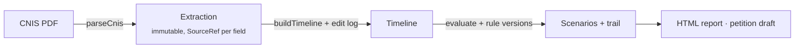

<p align="center">
  
</p>

<h1 align="center">Nexo</h1>

<p align="center">
  <em>From the CNIS to the retirement scenario, with every number traceable.</em>
</p>

<p align="center">
  <a href="https://github.com/melogtm/nexo-showcase/actions/workflows/ci.yml"></a>
  
  
</p>

---

Nexo is a web app for Brazilian social-security (*previdenciário*) lawyers. Upload a client's **CNIS** extract (the PDF from Meu INSS) and get:

1. **A contribution timeline** you can review and edit. Every row has a status (`OK` / `PENDENTE` / `REVISAR`), and every edit is logged.
2. **The EC 103/2019 retirement scenarios side by side**: the four transition rules plus the permanent rule. Each shows eligibility today, the requirements that are met or missing, and a projected date.
3. **A trail behind every number**: CNIS page and line, the rule applied, and the rule version.

Lawyers do this by hand today, copying values between the PDF, a spreadsheet and a calculator. Nexo treats **extraction → calculation → justification** as one auditable chain.

> Academic MVP (ACH2008, EACH/USP), not a production legal product. Nothing here is legal advice.

## What it has to prove

| | Hypothesis | How |
|---|---|---|
| **H1** | Reliable extraction under incomplete information | A deterministic parser (no LLM). Anything it can't read shows up as `REVISAR` or as an unparsed excerpt, never as a silent error. Measured with `npm run eval:h1`. |
| **H2** | Versioned, re-executable rules | Legal parameters are data rows with validity periods. A saved calculation re-runs to the exact same result. |

## How it works



The core is a set of pure functions. The database and the UI are thin shells around them. Lawyer edits are an append-only log replayed over the untouched parser output, so every change stays auditable.

## Quick start

Requires Node ≥ 22. No Docker needed: dev and tests run on embedded PGlite.

```bash
npm ci
npm run dev        # http://localhost:3000 · login nexo / nexo
```

Try it with the synthetic sample [`public/cnis-exemplo-sintetico.pdf`](public/cnis-exemplo-sintetico.pdf).

| Command | What it does |
|---|---|
| `npm test` | Vitest, each file on a fresh in-memory database |
| `npm run lint && npx tsc --noEmit` | Lint and type-check |
| `npm run eval:h1` | H1 extraction metric on the public sample |
| `npm run db:generate` | New SQL migration after editing `src/db/schema.ts` |

## Stack

Next.js 16 (App Router, Server Actions) · React 19 · TypeScript · Drizzle ORM · Postgres (Neon in prod, PGlite locally) · Temporal for dates · Vitest. Deployed on Vercel.

## Security & privacy

- **No real CNIS in the repo.** The public deploy runs on synthetic data only, and CPF, NIT and names are never logged.
- Single-user login with an HMAC-signed cookie. The session is re-checked in every server action and route.
- **Supply chain:** installs from the lockfile only (`npm ci`), with install scripts disabled. Registry signatures are verified in CI, and Dependabot waits 7 days before proposing a new release.
- `main` is protected: changes land through a PR with green CI.

<p align="center"><sub>✱ NEXO</sub></p>
